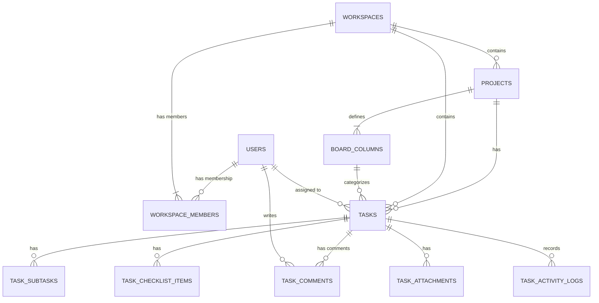

# Radius — Kontrak API & Skema Database (plan_api.md)

Dokumen ini mendefinisikan seluruh endpoint, kontrak API, serta skema dan relasi database untuk mempermudah development backend.

* **Status Implementasi di Frontend**:
  * `✅ Terimplementasi` — Layer service/API sudah terhubung di frontend.
  * `⬜ Belum Diimplementasi` — Frontend masih menggunakan data mock lokal.

---

## 1. Protokol Global & Envelope Standar

### 1.1 Headers
```http
Accept: application/json
Content-Type: application/json
Authorization: Bearer <access_token>
```

### 1.2 Format Response Sukses (`ApiEnvelope`)
```json
{
  "isSuccess": true,
  "data": null,
  "message": "Operasi berhasil."
}
```

### 1.3 Format Response Error (`ApiFailureResponse`)
```json
{
  "error": {
    "type": "ValidationError",
    "code": "INVALID_CREDENTIALS",
    "message": "Email atau password salah."
  }
}
```

---

## 2. Skema & Relasi Database

### 2.1 Diagram Relasi (ERD)



### 2.2 Definisi Tabel & Field

#### 1. `users`
Tabel untuk menyimpan data pengguna terautentikasi.
* **`id`** (PK, string/uuid): Identifier unik.
* **`name`** (string): Nama lengkap.
* **`email`** (string, Unique): Email pengguna.
* **`password_hash`** (string): Hash password (hanya di backend).
* **`email_verified_at`** (timestamp, nullable): Waktu verifikasi email.
* **`avatar_url`** (string, nullable): URL foto profil.
* **`last_login_at`** (timestamp, nullable): Waktu login terakhir.
* **`timezone`** (string, nullable): Zona waktu default (contoh: "Asia/Jakarta").
* **`locale`** (string, default: "id"): Preferensi bahasa.
* **`created_at`** (timestamp)
* **`updated_at`** (timestamp)

#### 2. `workspaces`
Tabel organisasi/workspace (multi-tenant container).
* **`id`** (PK, string/uuid): Identifier unik.
* **`name`** (string): Nama workspace.
* **`slug`** (string, Unique): URL slug workspace.
* **`created_at`** (timestamp)
* **`updated_at`** (timestamp)

#### 3. `workspace_members`
Tabel relasi (pivot) antara user dan workspace dengan roles.
* **`id`** (PK, string/uuid)
* **`workspace_id`** (FK -> `workspaces.id`, Cascade Delete)
* **`user_id`** (FK -> `users.id`, Nullable, Cascade Delete): Nullable untuk mendukung undangan member yang belum registrasi.
* **`name`** (string): Nama anggota (default dari email/user).
* **`email`** (string): Email anggota (untuk verifikasi / invite).
* **`role`** (enum: "owner", "admin", "member", "viewer")
* **`status`** (enum: "active", "pending")
* **`created_at`** (timestamp)
* **`updated_at`** (timestamp)

#### 4. `projects`
Tabel proyek di bawah suatu workspace.
* **`id`** (PK, string/uuid)
* **`workspace_id`** (FK -> `workspaces.id`, Cascade Delete)
* **`name`** (string)
* **`description`** (text/html): Deskripsi proyek dalam format HTML/RichText.
* **`icon`** (string): Emoji atau string icon identifier (default: "🚀").
* **`cover`** (enum: "emerald", "ocean", "sunset", "violet", "rose", "slate")
* **`cover_image_url`** (string, nullable): Custom cover image URL.
* **`status`** (enum: "active", "on_hold", "completed")
* **`is_favorite`** (boolean, default: false): (Catatan: Bisa dipindah ke pivot table `project_favorites` jika per-user favorit).
* **`archived_at`** (timestamp, nullable)
* **`open_tasks`** (integer, default: 0): Cache jumlah task aktif.
* **`progress`** (integer, default: 0): Persentase progress task selesai (0-100).
* **`created_at`** (timestamp)
* **`updated_at`** (timestamp)

#### 5. `board_columns`
Tabel kolom kustom Kanban di bawah suatu project.
* **`id`** (PK, string/uuid)
* **`project_id`** (FK -> `projects.id`, Cascade Delete)
* **`title`** (string): Nama kolom (contoh: "To Do", "In Progress").
* **`status`** (enum: "backlog", "todo", "in_progress", "review", "done")
* **`wip_limit`** (integer, nullable): Limit Work In Progress.
* **`order`** (integer): Urutan sorting kolom.
* **`created_at`** (timestamp)
* **`updated_at`** (timestamp)

#### 6. `tasks`
Tabel utama manajemen pekerjaan.
* **`id`** (PK, string/uuid)
* **`project_id`** (FK -> `projects.id`, Cascade Delete)
* **`workspace_id`** (FK -> `workspaces.id`, Cascade Delete)
* **`title`** (string)
* **`description`** (text): Deskripsi tugas.
* **`status`** (enum: "backlog", "todo", "in_progress", "review", "done")
* **`column_id`** (FK -> `board_columns.id`, Nullable, Set Null on Delete): Kolom kanban tempat task berada.
* **`priority`** (enum: "low", "medium", "high", "urgent")
* **`due_at`** (timestamp, nullable)
* **`label_ids`** (json/array of string): Array label (contoh: `["lbl_red", "lbl_blue"]`).
* **`assignee_id`** (FK -> `users.id`, Nullable, Set Null)
* **`created_at`** (timestamp)
* **`updated_at`** (timestamp)

#### 7. `task_subtasks`
Daftar child-tasks terstruktur yang tersemat dalam satu task.
* **`id`** (PK, string/uuid)
* **`task_id`** (FK -> `tasks.id`, Cascade Delete)
* **`title`** (string)
* **`done`** (boolean, default: false)

#### 8. `task_checklist_items`
Daftar checklist ringan di dalam detail task.
* **`id`** (PK, string/uuid)
* **`task_id`** (FK -> `tasks.id`, Cascade Delete)
* **`text`** (string)
* **`checked`** (boolean, default: false)

#### 9. `task_attachments`
File lampiran yang diupload ke suatu task.
* **`id`** (PK, string/uuid)
* **`task_id`** (FK -> `tasks.id`, Cascade Delete)
* **`name`** (string): Nama file asli.
* **`size`** (bigint): Ukuran file dalam bytes.
* **`mime_type`** (string): Tipe file (contoh: "image/png").
* **`uploaded_at`** (timestamp)

#### 10. `task_comments`
Tabel percakapan dan feedback di dalam task.
* **`id`** (PK, string/uuid)
* **`task_id`** (FK -> `tasks.id`, Cascade Delete)
* **`author_id`** (FK -> `users.id`, Nullable, Set Null): Pembuat komentar.
* **`author_name`** (string): Nama pembuat (untuk cache cepat).
* **`body`** (text): Teks komentar (mendukung mention token format: `@[Nama](usr_id)`).
* **`mention_ids`** (json/array of string): Array User ID yang di-mention di dalam komentar.
* **`created_at`** (timestamp)
* **`updated_at`** (timestamp)

#### 11. `task_activity_logs`
Catatan riwayat perubahan (history) dari suatu task.
* **`id`** (PK, string/uuid)
* **`task_id`** (FK -> `tasks.id`, Cascade Delete)
* **`title`** (string): Contoh "Status changed", "Priority updated".
* **`description`** (string, nullable): Contoh "Todo -> In Progress".
* **`icon`** (string): Class icon UI (contoh: "i-lucide-arrow-right-left").
* **`occurred_at`** (timestamp)

#### 12. `notifications`
Tabel notifikasi in-app untuk pengguna.
* **`id`** (PK, string/uuid)
* **`recipient_email`** (string): Email penerima notifikasi.
* **`workspace_id`** (FK -> `workspaces.id`, Cascade Delete)
* **`type`** (enum: "mention", "comment", "assign", "project", "workspace", "system")
* **`title`** (string)
* **`body`** (string)
* **`icon`** (string): Class icon UI.
* **`read_at`** (timestamp, nullable): Null jika belum dibaca.
* **`link`** (json, nullable): Payload navigasi (contoh: `{"kind": "task", "taskId": "tsk_1", "projectId": "proj_1"}`)
* **`created_at`** (timestamp)

---

## 3. Endpoint Referensi

### 3.1 Authentication & User Profile (`✅ Terimplementasi`)

#### `POST /auth/register`
* **Request**:
  ```json
  {
    "name": "John Doe",
    "email": "john@example.com",
    "password": "strongpassword123"
  }
  ```
* **Response (201 Created)**:
  ```json
  {
    "isSuccess": true,
    "data": {
      "accessToken": "jwt_token_here",
      "tokenType": "Bearer",
      "expiresIn": 3600,
      "user": {
        "id": "usr_1",
        "name": "John Doe",
        "email": "john@example.com",
        "avatarUrl": null
      }
    }
  }
  ```

#### `POST /auth/login`
* **Request**:
  ```json
  {
    "email": "john@example.com",
    "password": "strongpassword123"
  }
  ```
* **Response (200 OK)**: Sama dengan response `POST /auth/register` (Token + User detail).

#### `GET /auth/sso/google/url`
* **Query Params**: `redirect_uri=http://localhost:3000/auth/callback`
* **Response (200 OK)**:
  ```json
  {
    "isSuccess": true,
    "data": {
      "authUrl": "https://accounts.google.com/o/oauth2/v2/auth?...",
      "state": "random_secure_state"
    }
  }
  ```

#### `POST /auth/sso/google/callback`
* **Request**:
  ```json
  {
    "code": "oauth_code_here",
    "state": "random_secure_state"
  }
  ```
* **Response (200 OK)**: Sama dengan response `POST /auth/register` (Token + User detail).

#### `GET /auth/sso/github/url`
* **Query Params**: `redirect_uri=http://localhost:3000/auth/callback`
* **Response (200 OK)**:
  ```json
  {
    "isSuccess": true,
    "data": {
      "authUrl": "https://github.com/login/oauth/authorize?...",
      "state": "random_secure_state"
    }
  }
  ```

#### `POST /auth/sso/github/callback`
* **Request**:
  ```json
  {
    "code": "oauth_code_here",
    "state": "random_secure_state"
  }
  ```
* **Response (200 OK)**: Sama dengan response `POST /auth/register` (Token + User detail).

#### `GET /users/me`
* **Response (200 OK)**:
  ```json
  {
    "isSuccess": true,
    "data": {
      "id": "usr_1",
      "name": "John Doe",
      "email": "john@example.com",
      "emailVerifiedAt": "2026-06-01T12:00:00Z",
      "avatarUrl": "https://avatar.url/image.jpg",
      "lastLoginAt": "2026-06-02T10:00:00Z",
      "timezone": "Asia/Jakarta",
      "locale": "id",
      "createdAt": "2026-06-01T12:00:00Z",
      "updatedAt": "2026-06-02T10:00:00Z"
    }
  }
  ```

---

### 3.2 Workspaces (`✅ Terimplementasi`)

#### `GET /workspaces`
* **Response (200 OK)**:
  ```json
  {
    "isSuccess": true,
    "data": [
      {
        "id": "ws_1",
        "name": "Acme Workspace",
        "slug": "acme-workspace",
        "createdAt": "2026-06-01T12:00:00Z"
      }
    ]
  }
  ```

#### `POST /workspaces`
* **Request**:
  ```json
  {
    "name": "New Studio",
    "slug": "new-studio"
  }
  ```
* **Response (201 Created)**:
  ```json
  {
    "isSuccess": true,
    "data": {
      "id": "ws_2",
      "name": "New Studio",
      "slug": "new-studio",
      "createdAt": "2026-06-02T10:30:00Z"
    }
  }
  ```

#### `PATCH /workspaces/:workspaceId`
* **Request**:
  ```json
  {
    "name": "New Studio Ltd",
    "slug": "new-studio-ltd"
  }
  ```
* **Response (200 OK)**:
  ```json
  {
    "isSuccess": true,
    "data": {
      "id": "ws_2",
      "name": "New Studio Ltd",
      "slug": "new-studio-ltd",
      "createdAt": "2026-06-02T10:30:00Z"
    }
  }
  ```

#### `GET /workspaces/:workspaceId/members`
* **Response (200 OK)**:
  ```json
  {
    "isSuccess": true,
    "data": [
      {
        "id": "mbr_1",
        "workspaceId": "ws_2",
        "name": "John Doe",
        "email": "john@example.com",
        "role": "owner",
        "status": "active"
      }
    ]
  }
  ```

#### `POST /workspaces/:workspaceId/members`
* **Request**:
  ```json
  {
    "email": "colleague@example.com",
    "role": "member"
  }
  ```
* **Response (201 Created)**:
  ```json
  {
    "isSuccess": true,
    "data": {
      "id": "mbr_2",
      "workspaceId": "ws_2",
      "name": "Colleague",
      "email": "colleague@example.com",
      "role": "member",
      "status": "pending"
    }
  }
  ```

#### `PATCH /workspaces/:workspaceId/members/:memberId`
* **Request**:
  ```json
  {
    "role": "admin"
  }
  ```
* **Response (200 OK)**:
  ```json
  {
    "isSuccess": true,
    "data": {
      "ok": true
    }
  }
  ```

#### `DELETE /workspaces/:workspaceId/members/:memberId`
* **Response (200 OK)**:
  ```json
  {
    "isSuccess": true,
    "data": {
      "ok": true
    }
  }
  ```

---

### 3.3 Projects (`⬜ Belum Diimplementasi`)

#### `GET /workspaces/:workspaceId/projects`
* **Response (200 OK)**:
  ```json
  {
    "isSuccess": true,
    "data": [
      {
        "id": "proj_1",
        "workspaceId": "ws_1",
        "name": "Design System",
        "description": "<p>UI project kit</p>",
        "icon": "🎨",
        "cover": "violet",
        "coverImageUrl": null,
        "status": "active",
        "isFavorite": false,
        "archivedAt": null,
        "openTasks": 12,
        "progress": 45,
        "createdAt": "2026-06-01T12:00:00Z",
        "updatedAt": "2026-06-02T10:00:00Z"
      }
    ]
  }
  ```

#### `POST /workspaces/:workspaceId/projects`
* **Request**:
  ```json
  {
    "name": "Product Launch",
    "description": "<p>GTM roadmap</p>",
    "icon": "🚀",
    "cover": "emerald",
    "coverImageUrl": null,
    "status": "active"
  }
  ```
* **Response (201 Created)**:
  ```json
  {
    "isSuccess": true,
    "data": {
      "id": "proj_2",
      "workspaceId": "ws_1",
      "name": "Product Launch",
      "description": "<p>GTM roadmap</p>",
      "icon": "🚀",
      "cover": "emerald",
      "coverImageUrl": null,
      "status": "active",
      "isFavorite": false,
      "archivedAt": null,
      "openTasks": 0,
      "progress": 0,
      "createdAt": "2026-06-02T10:30:00Z",
      "updatedAt": "2026-06-02T10:30:00Z"
    }
  }
  ```

#### `PATCH /projects/:projectId`
* **Request**:
  ```json
  {
    "name": "Product Launch v2",
    "isFavorite": true
  }
  ```
* **Response (200 OK)**:
  ```json
  {
    "isSuccess": true,
    "data": {
      "id": "proj_2",
      "workspaceId": "ws_1",
      "name": "Product Launch v2",
      "description": "<p>GTM roadmap</p>",
      "icon": "🚀",
      "cover": "emerald",
      "coverImageUrl": null,
      "status": "active",
      "isFavorite": true,
      "archivedAt": null,
      "openTasks": 0,
      "progress": 0,
      "createdAt": "2026-06-02T10:30:00Z",
      "updatedAt": "2026-06-02T10:35:00Z"
    }
  }
  ```

#### `PATCH /projects/:projectId/favorite`
* **Response (200 OK)**:
  ```json
  {
    "isSuccess": true,
    "data": {
      "id": "proj_2",
      "isFavorite": true
    }
  }
  ```

#### `PATCH /projects/:projectId/archive`
* **Response (200 OK)**:
  ```json
  {
    "isSuccess": true,
    "data": {
      "id": "proj_2",
      "archivedAt": "2026-06-02T10:36:00Z"
    }
  }
  ```

#### `PATCH /projects/:projectId/unarchive`
* **Response (200 OK)**:
  ```json
  {
    "isSuccess": true,
    "data": {
      "id": "proj_2",
      "archivedAt": null
    }
  }
  ```

#### `DELETE /projects/:projectId`
* **Response (200 OK)**:
  ```json
  {
    "isSuccess": true,
    "data": {
      "ok": true
    }
  }
  ```

---

### 3.4 Kanban Board Columns (`⬜ Belum Diimplementasi`)

#### `GET /projects/:projectId/board/columns`
* **Response (200 OK)**:
  ```json
  {
    "isSuccess": true,
    "data": [
      {
        "id": "col_1",
        "title": "To Do",
        "status": "todo",
        "wipLimit": 5,
        "order": 0
      }
    ]
  }
  ```

#### `POST /projects/:projectId/board/columns`
* **Request**:
  ```json
  {
    "title": "Quality Review",
    "status": "review",
    "wipLimit": 3
  }
  ```
* **Response (201 Created)**:
  ```json
  {
    "isSuccess": true,
    "data": {
      "id": "col_2",
      "title": "Quality Review",
      "status": "review",
      "wipLimit": 3,
      "order": 1
    }
  }
  ```

#### `PATCH /projects/:projectId/board/columns/:columnId`
* **Request**:
  ```json
  {
    "title": "QA Review",
    "wipLimit": 4
  }
  ```
* **Response (200 OK)**:
  ```json
  {
    "isSuccess": true,
    "data": {
      "id": "col_2",
      "title": "QA Review",
      "status": "review",
      "wipLimit": 4,
      "order": 1
    }
  }
  ```

#### `PUT /projects/:projectId/board/columns/reorder`
* **Request**:
  ```json
  {
    "columnIds": ["col_2", "col_1"]
  }
  ```
* **Response (200 OK)**:
  ```json
  {
    "isSuccess": true,
    "data": {
      "ok": true
    }
  }
  ```

#### `DELETE /projects/:projectId/board/columns/:columnId`
* **Response (200 OK)**:
  ```json
  {
    "isSuccess": true,
    "data": {
      "ok": true,
      "fallbackColumnId": "col_1"
    }
  }
  ```

---

### 3.5 Tasks (`⬜ Belum Diimplementasi`)

#### `GET /projects/:projectId/tasks`
* **Response (200 OK)**:
  ```json
  {
    "isSuccess": true,
    "data": [
      {
        "id": "tsk_1",
        "projectId": "proj_1",
        "workspaceId": "ws_1",
        "title": "Add color tokens",
        "description": "Establish Tailwind/semantic colors",
        "status": "todo",
        "columnId": "col_1",
        "priority": "high",
        "dueAt": "2026-06-10T12:00:00Z",
        "labelIds": ["lbl_red"],
        "assigneeId": "usr_1",
        "subtasks": [
          { "id": "sub_1", "title": "Define dark mode", "done": false }
        ],
        "checklist": [
          { "id": "chk_1", "text": "Colors approved", "checked": false }
        ],
        "attachments": [],
        "createdAt": "2026-06-01T12:00:00Z",
        "updatedAt": "2026-06-01T12:00:00Z"
      }
    ]
  }
  ```

#### `POST /projects/:projectId/tasks`
* **Request**:
  ```json
  {
    "title": "Configure ESLint",
    "description": "Add config matching template",
    "status": "todo",
    "columnId": "col_1",
    "priority": "medium",
    "dueAt": null,
    "labelIds": [],
    "assigneeId": null
  }
  ```
* **Response (201 Created)**:
  ```json
  {
    "isSuccess": true,
    "data": {
      "id": "tsk_2",
      "projectId": "proj_1",
      "workspaceId": "ws_1",
      "title": "Configure ESLint",
      "description": "Add config matching template",
      "status": "todo",
      "columnId": "col_1",
      "priority": "medium",
      "dueAt": null,
      "labelIds": [],
      "assigneeId": null,
      "subtasks": [],
      "checklist": [],
      "attachments": [],
      "createdAt": "2026-06-02T10:30:00Z",
      "updatedAt": "2026-06-02T10:30:00Z"
    }
  }
  ```

#### `PATCH /tasks/:taskId`
* **Request**:
  ```json
  {
    "status": "in_progress",
    "columnId": "col_2",
    "subtasks": [
      { "id": "sub_1", "title": "Define dark mode", "done": true }
    ]
  }
  ```
* **Response (200 OK)**:
  ```json
  {
    "isSuccess": true,
    "data": {
      "id": "tsk_1",
      "status": "in_progress",
      "columnId": "col_2",
      "subtasks": [
        { "id": "sub_1", "title": "Define dark mode", "done": true }
      ]
    }
  }
  ```

#### `DELETE /tasks/:taskId`
* **Response (200 OK)**:
  ```json
  {
    "isSuccess": true,
    "data": {
      "ok": true
    }
  }
  ```

#### `GET /tasks/:taskId/activities`
* **Response (200 OK)**:
  ```json
  {
    "isSuccess": true,
    "data": [
      {
        "id": "act_1",
        "taskId": "tsk_1",
        "title": "Task created",
        "description": "Add color tokens",
        "occurredAt": "2026-06-01T12:00:00Z",
        "icon": "i-lucide-plus-circle"
      }
    ]
  }
  ```

#### `POST /tasks/:taskId/attachments`
* **Request**: `multipart/form-data` (field: `file`)
* **Response (201 Created)**:
  ```json
  {
    "isSuccess": true,
    "data": {
      "id": "att_1",
      "name": "spec.pdf",
      "size": 512000,
      "mimeType": "application/pdf",
      "uploadedAt": "2026-06-02T10:40:00Z"
    }
  }
  ```

#### `DELETE /tasks/:taskId/attachments/:attachmentId`
* **Response (200 OK)**:
  ```json
  {
    "isSuccess": true,
    "data": {
      "ok": true
    }
  }
  ```

---

### 3.6 Task Comments (`⬜ Belum Diimplementasi`)

#### `GET /tasks/:taskId/comments`
* **Response (200 OK)**:
  ```json
  {
    "isSuccess": true,
    "data": [
      {
        "id": "cmt_1",
        "taskId": "tsk_1",
        "authorId": "usr_2",
        "authorName": "Jane Doe",
        "body": "Hi @[John Doe](usr_1), please review.",
        "mentionIds": ["usr_1"],
        "createdAt": "2026-06-02T10:00:00Z",
        "updatedAt": "2026-06-02T10:00:00Z"
      }
    ]
  }
  ```

#### `POST /tasks/:taskId/comments`
* **Request**:
  ```json
  {
    "body": "Hi @[John Doe](usr_1), please review.",
    "authorId": "usr_2",
    "authorName": "Jane Doe"
  }
  ```
* **Response (201 Created)**:
  ```json
  {
    "isSuccess": true,
    "data": {
      "id": "cmt_1",
      "taskId": "tsk_1",
      "authorId": "usr_2",
      "authorName": "Jane Doe",
      "body": "Hi @[John Doe](usr_1), please review.",
      "mentionIds": ["usr_1"],
      "createdAt": "2026-06-02T10:00:00Z",
      "updatedAt": "2026-06-02T10:00:00Z"
    }
  }
  ```

#### `PATCH /comments/:commentId`
* **Request**:
  ```json
  {
    "body": "Wait, I updated the review comments."
  }
  ```
* **Response (200 OK)**:
  ```json
  {
    "isSuccess": true,
    "data": {
      "id": "cmt_1",
      "body": "Wait, I updated the review comments.",
      "updatedAt": "2026-06-02T10:05:00Z"
    }
  }
  ```

#### `DELETE /comments/:commentId`
* **Response (200 OK)**:
  ```json
  {
    "isSuccess": true,
    "data": {
      "ok": true
    }
  }
  ```

---

### 3.7 Notifications (`⬜ Belum Diimplementasi`)

#### `GET /notifications`
* **Response (200 OK)**:
  ```json
  {
    "isSuccess": true,
    "data": [
      {
        "id": "not_1",
        "recipientEmail": "john@example.com",
        "workspaceId": "ws_1",
        "type": "mention",
        "title": "Jane Doe mentioned you",
        "body": "Add color tokens — Hi @[John Doe](usr_1), please review.",
        "icon": "i-lucide-at-sign",
        "readAt": null,
        "createdAt": "2026-06-02T10:00:00Z",
        "link": {
          "kind": "task",
          "taskId": "tsk_1",
          "projectId": "proj_1",
          "workspaceId": "ws_1"
        }
      }
    ]
  }
  ```

#### `PATCH /notifications/:notificationId/read`
* **Response (200 OK)**:
  ```json
  {
    "isSuccess": true,
    "data": {
      "ok": true
    }
  }
  ```

#### `POST /notifications/read-all`
* **Request**:
  ```json
  {
    "recipientEmail": "john@example.com"
  }
  ```
* **Response (200 OK)**:
  ```json
  {
    "isSuccess": true,
    "data": {
      "ok": true
    }
  }
  ```

#### `DELETE /notifications/:notificationId`
* **Response (200 OK)**:
  ```json
  {
    "isSuccess": true,
    "data": {
      "ok": true
    }
  }
  ```
